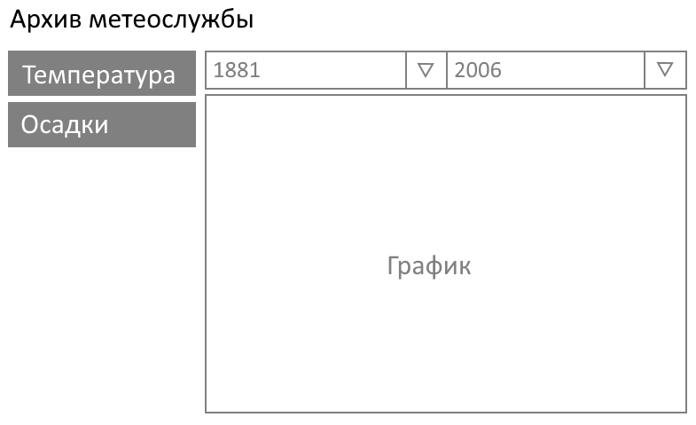

## Задача
Реализовать визуализацию изменений температуры и уровня осадков за последние.

## Макет


## Техническое задание
- по умолчанию пользователь должен видеть данные изменения температуры **за весь период**, то есть должны использоваться все данные полученные с сервера
- пользователь должен иметь возможность указать период с точностью до года
- интерфейс не должен "замораживаться" и пользователю должны быть доступны для выбора все элементы управления в любой момент времени
- для отображения графика использовать Canvas
- для построения графика используются данные из IndexedDB
- данные на клиенте хранятся в двух таблицах temperature и precipitation
- данные для каждой из таблиц запрашиваются с сервера отдельно
- при отсутствии данных в таблице, данные для нее запрашиваются с сервера
- данные с сервера запрашиваются по требованию, когда произошло обращение за соответствующими данными в локальную базу данных и они в ней не найдены
- запись **за отдельный день** должна хранится как **отдельный объект/запись** в IndexedDB

## Требование к исходному коду
- исходный код должен содержать необходимые комментарии
- аккуратность исходного кода будет оцениваться наряду с функциональностью приложения

## Технические требования
- нельзя использовать сторонние библиотеки для отрисовки графиков и работы с IndexedDb
- приложение должно работать в последних версиях Chrome и Firefox

## Установка и запуск
- сделать fork репозитория

- выбрать один из фреймворков React/Vue/Svelte/Vanilla

- установить зависимости
    ```
    npm install
    ```

- запустить
    ```
    npm start
    ```
